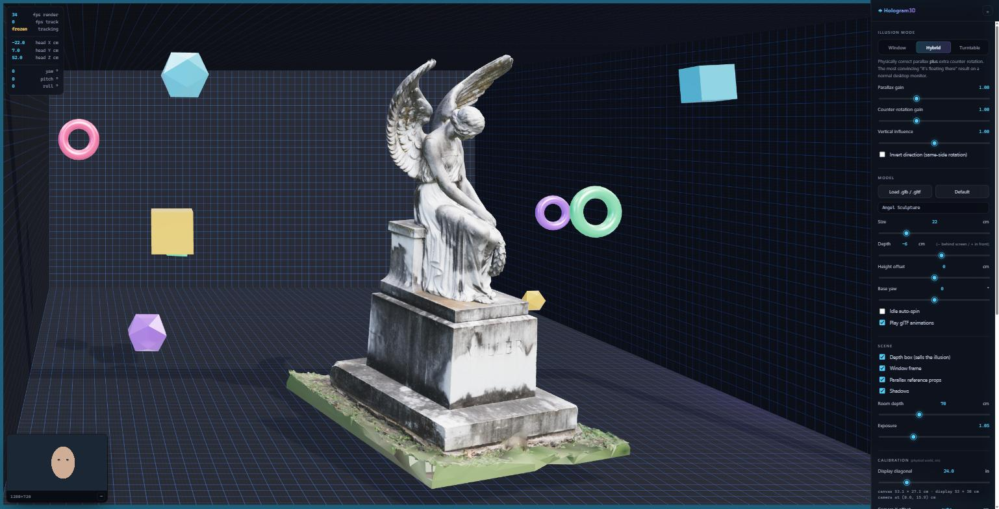
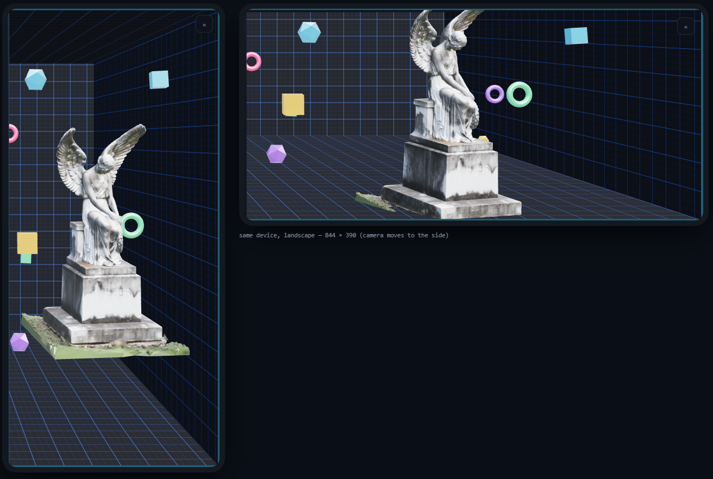

# ◈ Cam2Hologram — a window into 3D reality

**Turn any ordinary webcam — laptop or phone — into a window into 3D space.**

MediaPipe Face Mesh tracks your eyes in real space; the scene is then rendered with an
**off-axis (asymmetric) projection** locked to your eye position. The model counter-rotates
against your movement — move to your left and its right side swings toward you — so it reads
as a physical object sitting in the space around your screen rather than a picture on it.

Everything runs locally in the browser. No video ever leaves your device, and after the
first load there are **no network requests at all** — every dependency is vendored.

### ▶ [Try it live](https://rmanmetaverse.github.io/Cam2Hologram-Window-into-3D-reality-/)



> The viewer's head is 22 cm to the **left** of centre, so the statue has swung to show its
> **right** side, the depth box's right wall has come into view, and the near props have
> swept across the far ones. Nothing here is scripted — it is all a consequence of the
> frustum being sheared to the tracked eye position.

---

## Contents

- [Running it](#running-it)
- [Offline by default](#offline-by-default)
- [On a phone](#on-a-phone)
- [Deploying to GitHub Pages](#deploying-to-github-pages)
- [How it works](#how-it-works)
- [Calibration](#calibration)
- [Loading your own model](#loading-your-own-model)
- [Keyboard](#keyboard)
- [Tests](#tests)
- [Project layout](#project-layout)
- [Troubleshooting](#troubleshooting)

---

## Running it

The app needs a real HTTP origin: `getUserMedia` is restricted to secure contexts
(`http://localhost` counts) and ES modules will not load over `file://`.

```bash
git clone https://github.com/RmaNMetaverse/Cam2Hologram-Window-into-3D-reality-.git
cd Cam2Hologram-Window-into-3D-reality-

start.bat                          # Windows — opens http://localhost:8000 for you
python serve.py                    # any platform
npx http-server . -p 8000 -c-1     # if you would rather use Node
```

Then click **Enable camera & start** and allow camera access.

No build step, no `npm install`, and **no internet connection required** — clone, serve,
run. See [Offline by default](#offline-by-default).

**Close one eye.** The illusion is monocular — with both eyes open, your stereo vision
correctly reports that the screen is flat, and fights the effect.

---

## Offline by default

Every third-party dependency is committed under [`vendor/`](vendor/) (~28 MB). A fresh clone
on a machine with no network runs identically to one online:

| | Version | Size |
|---|---|---|
| three.js core + the four addons this app imports | 0.170.0 | ~1.5 MB |
| DRACO decoder + Basis/KTX2 transcoder | from three.js | ~1.3 MB |
| MediaPipe `tasks-vision` runtime (SIMD + no-SIMD wasm) | 1.0.1 | ~23 MB |
| `face_landmarker.task` model | float16/1 | 3.6 MB |

Regenerate or verify the tree with:

```bash
node tools/vendor.mjs           # repopulate vendor/ from npm + Google's model host
node tools/vendor.mjs --check   # verify completeness, exit 1 if anything is missing
```

`tools/vendor.mjs` resolves the three.js addon import graph automatically rather than
trusting a hand-written file list — the addons import each other by relative path, and that
graph shifts between releases, so a hand-copied tree works right up until the day it quietly
doesn't. It also trims what is provably unused: MediaPipe's 12 MB `_module_` wasm pair (only
requested when you ask `forVisionTasks` for the module build, which this app never does) and
the DRACO *encoder* (~1 MB, never touched by a loader).

The no-SIMD wasm **is** kept — it is the fallback for iOS Safari before 16.4, which is
exactly the old-phone case this app cares about.

CDN URLs still appear in `js/tracker.js` as a **fallback only**. They are never reached in a
healthy install; they exist so a checkout with a damaged `vendor/` still starts instead of
dying at the splash screen, and it logs a warning telling you to re-run the vendor script.

> Verified by loading the app with the browser's network log open: all 35 requests resolve to
> the local origin, including the MediaPipe wasm and the landmark model.

---

## On a phone



Phones work, and are in some ways the better demo: you can physically move the device as
well as your head. Two things need care.

### 1 · Serve over HTTPS

`http://localhost` is a secure context, but `http://192.168.1.x` is **not** — a phone
reaching your dev server over the LAN will be refused the camera with no useful error.
The bundled server generates a self-signed certificate for you:

```bash
python serve.py --https     # or: start.bat --https
```

It prints both the local and LAN URLs. Open the LAN one on the phone, accept the
certificate warning once (**Advanced → Proceed**), and the camera works normally.
`ngrok http 8000` or `cloudflared tunnel` are fine alternatives.

### 2 · What the app adapts on its own

| | Desktop | Phone |
|---|---|---|
| Display diagonal | 24″ | 6.1″ |
| Model / room scale | 22 cm / 70 cm | 7 cm / 25 cm |
| Resting view distance | 60 cm | 35 cm |
| Shadows | on | off |
| Pixel-ratio ceiling | 2.0× | 1.75× |
| Camera preview & HUD | shown | hidden |

Device class is decided from the display's **short edge in CSS pixels**, not the user-agent
string, so it survives desktop-mode requests and browsers that lie about who they are. Your
own calibration is never overwritten — the defaults are seeded once, the first time the app
meets a given class of device.

Beyond that, three mobile-specific things happen:

- **Rotation moves the camera.** A phone's front camera is bonded to the top of the display
  in its natural orientation. Turn the phone to landscape and that camera is now at the
  *side* — roughly 7 cm from centre on a modern handset, which is a large error to ignore.
  The offset vector is rotated with the viewport on every orientation change.
- **Focal length is measured on the long image axis.** The same sensor gives 1280×720 in
  landscape and 720×1280 in portrait. Anchoring focal length to image *width* would halve it
  on rotation and report you at twice your true distance.
- **Resolution adapts.** Phones report `devicePixelRatio: 3`, which means shading nine
  fragments per CSS pixel. Head tracking is latency-critical — a low frame rate reads as the
  object lagging behind your head, which breaks the illusion far more visibly than a softer
  image — so resolution is what gives way when the frame budget is missed.

iOS has no Fullscreen API on iPhone. Use **Share → Add to Home Screen** and launch from
there; the app ships the meta tags for a fullscreen standalone shell.

---

## Deploying to GitHub Pages

Pages serves over **HTTPS**, which is a secure context — so the camera works on phones with
no certificate warnings and no LAN tunnelling. It is the easiest way to use this on a phone.

This repo is already deployed:
**https://rmanmetaverse.github.io/Cam2Hologram-Window-into-3D-reality-/**

There is no build step. The site is the repository root, served as-is.

### Enabling it on your own fork

**Via the web UI** — *Settings → Pages → Build and deployment*, set **Source** to
*Deploy from a branch*, branch `main`, folder `/ (root)`, then **Save**. First publish takes
a minute or two.

**Via the CLI:**

```bash
gh api -X POST repos/OWNER/REPO/pages   -f "source[branch]=main" -f "source[path]=/"

gh api repos/OWNER/REPO/pages --jq '.status, .html_url'   # check progress
```

### Why it works unmodified

- **`.nojekyll`** is committed. Without it, Pages runs the files through Jekyll, which
  silently drops paths beginning with `_` and adds build latency for nothing.
- **Every path is relative.** The app is served from `/REPO-NAME/`, not a domain root, so any
  absolute `/js/...` path would 404. Runtime asset URLs (the DRACO and Basis decoders, the
  MediaPipe wasm and model) are resolved against `import.meta.url` rather than the document,
  so they stay correct at any depth.
- **The MediaPipe bundle is vendored as `.js`, not `.mjs`.** Some static hosts serve `.mjs`
  with a MIME type browsers reject for modules, which would kill the module load outright.
  The content is byte-identical; only the extension changes.

### Size

The published site is roughly 78 MB — 29 MB of vendored runtime plus 48 MB for the bundled
Angel model. Well inside the 1 GB Pages limit, but if you want a lean deploy, swap the model
for a compressed `.glb`; the app falls back to a built-in procedural object if none loads.

---

## How it works

### 1 · Where your eye is, in centimetres

MediaPipe gives 478 face landmarks, including both iris centres (468 and 473). Depth comes
from the apparent size of a known real-world length:

```
z = f · IPD_real / IPD_pixels        f = (longImageAxis / 2) / tan(fov / 2)
```

Interpupillary distance is the right choice here: it varies only ~4% across adults, it is
rigid (unlike face width, which moves with expression), and it barely foreshortens over the
head angles this app cares about.

Lateral position follows from the same pinhole model. One sign flip matters enormously:
**a camera faces you, so its raw image is not mirrored** — when you move to your own right,
your face moves toward *smaller* image x. Get this backwards and the whole illusion inverts.

The result is chained through the physical offsets — camera to screen centre, screen centre
to canvas centre — so a browser window sitting off to one side still produces a correct frustum.

### 2 · The off-axis frustum

This is the whole trick. A normal `PerspectiveCamera` assumes the viewer sits on the optical
axis, so its frustum is symmetric. Here the window is fixed in the world — the `w × h`
rectangle on the `z = 0` plane, which *is* your canvas — and your eye may be anywhere in
front of it. The frustum is sheared to keep the window's four corners pinned to the
viewport's four corners:

```
left   = (-w/2 - eyeX) · near / eyeZ
right  = ( w/2 - eyeX) · near / eyeZ
bottom = (-h/2 - eyeY) · near / eyeZ
top    = ( h/2 - eyeY) · near / eyeZ
```

The camera translates to your eye position and **never rotates** — rotating it would tilt the
window plane and shear the image instead of revealing sides.

Everything else follows from this shear: objects behind the glass drift *with* you, objects
in front drift *against* you, and sides come into view exactly as they would through a hole
cut in the wall.

### 3 · Counter-rotation

Off-axis projection alone is geometrically truthful but, on a 24″ monitor at 60 cm, subtle.
So the model is *additionally* rotated by the inverse of your angular displacement:

```
q = rotation taking normalize(eye − model) onto +Z,  with its angle scaled by gain
```

At gain 1 this exactly cancels your viewing angle. Move left, and the model yaws to its own
left, bringing its right side toward you.

Both effects are gains, so the three modes are one code path with different numbers:

| Mode | Parallax | Rotation | What it is |
|---|---|---|---|
| **Window** | 1.0 | 0.0 | Pure off-axis. Geometrically exact, subtle. Set your display size for this one. |
| **Hybrid** *(default)* | 1.0 | 1.0 | Correct parallax plus exaggeration. Most convincing on a normal screen. |
| **Turntable** | 0.0 | 2.0 | Fixed camera, model alone counter-rotates. Good for inspecting a model. |

### 4 · Smoothing

Head tracking must be simultaneously *still* when you hold your head steady and *snappy* when
you move; a fixed low-pass buys one only at the cost of the other. A
[1€ filter](https://gery.casiez.net/1euro/) adapts its cutoff to the observed speed — heavy
smoothing at rest, almost none in motion. A short exponential damp on top absorbs the
stair-stepping from a 30 fps camera feeding a 60 fps render.

### 5 · The set dressing is not decoration

The depth box, the window frame and the drifting props exist because head-coupled perspective
only reads as depth if the eye has something to compare against. A receding grid, a hard frame
at the screen plane, and objects at known distances give the visual system the occlusion and
motion-parallax cues it needs. With a bare model on black, the same maths just looks like a
model that is wobbling.

---

## Calibration

The defaults are reasonable, but the illusion is only *exact* if the app knows your physical
setup. In the **Calibration** panel:

| Setting | Why it matters |
|---|---|
| **Display diagonal** | Converts CSS pixels to centimetres. The single most important value. |
| **Camera X / Y offset** | Auto by default, and orientation-aware. Set manually for an external webcam. |
| **Camera FOV (long axis)** | Affects the depth estimate. 60–65° is typical; raise it if the model feels too close. |
| **Interpupillary distance** | Scales the depth estimate directly. Adult mean is 6.3 cm. |
| **Recentre** (`C`) | Sit comfortably, look at the centre of the canvas, press it. Makes your habitual position the on-axis one. |

The readout under the diagonal slider shows the measured canvas size and the derived camera
position, so you can sanity-check both against a tape measure.

---

## Loading your own model

Drag a **`.glb`** anywhere onto the window, or use **Load .glb / .gltf**. DRACO and
KTX2/Basis compression are both handled, and glTF animations play automatically.

Whatever the file contains is normalised on load: recentred on its own bounding box, scaled
so its longest axis matches the **Size** slider, and parked at the requested **Depth**. Author
units in glTF are metres by convention but in practice range over six orders of magnitude, so
this is not optional.

> A `.gltf` that references external `.bin` and texture files cannot resolve them from a
> drag-and-drop blob URL. Use a self-contained `.glb`, or place the asset folder next to
> `index.html` and point `modelUrl` at it — which is how the bundled
> `models/AngelSculpture/scene.gltf` loads.

**Depth** is the control worth playing with: negative values put the model behind the glass
(a diorama you look into), positive values push it out in front of the screen, into your room.

---

## Keyboard

| Key | |
|---|---|
| `H` | show / hide the control panel |
| `C` | recentre on your current position |
| `F` | fullscreen — the biggest single improvement to the effect |
| `P` | toggle the camera preview |
| `1` `2` `3` | Window / Hybrid / Turntable |
| `Space` | freeze tracking (holds the current viewpoint) |

---

## Tests

`tests/test.html` covers the geometry the illusion depends on — **54 assertions** over the
frustum, parallax direction, counter-rotation sign, landmark-to-world conversion, the offset
chain, mobile orientation handling, the 1€ filter, and config persistence.

```bash
python serve.py
# http://localhost:8000/tests/test.html    geometry suite
# http://localhost:8000/tests/mobile.html  responsive preview (real app in phone-sized frames)
```

The load-bearing assertions are worth knowing about:

- **window corners map to viewport corners for every eye position** — the defining property of
  the off-axis frustum. If this drifts, the hole in the wall becomes a wobbling picture.
- **object behind the screen moves with the viewer / in front moves against** — the classic
  sign error in head-coupled rendering, which makes a scene feel inside out.
- **face on the left of the raw image → viewer has moved to their right** — the un-mirrored
  camera flip.
- **viewer moves left → model yaws to its own left** — the feature in one line.
- **the same face at the same pixel size reports the same depth in either orientation** —
  catches the portrait/landscape focal-length trap.
- **every device default survives config range validation** — a regression guard for a real
  bug: a phone's 6.1″ diagonal was being silently rejected by the validator on *reload*,
  reverting the physical model to 24″ long after calibration appeared to work.

---

## Project layout

```
index.html            markup + import map
css/style.css         UI, including the touch and small-screen layers
js/
  main.js             orchestration and the render loop
  geometry.js         landmarks → centimetres, and the off-axis frustum
  scene.js            three.js scene, model loading, counter-rotation, adaptive resolution
  device.js           device class, physical defaults, orientation-aware camera position
  tracker.js          camera + MediaPipe FaceLandmarker
  stagecraft.js       depth box, window frame, parallax props
  filters.js          1€ filter
  config.js           persisted, range-validated settings
  ui.js               control panel wiring
  overlay.js          face-mesh preview
tests/
  test.html           geometry test suite
  mobile.html         responsive preview harness
tools/vendor.mjs      vendors all third-party deps into vendor/
vendor/               committed dependencies — three.js, MediaPipe, decoders, model
serve.py, start.bat   local static server, with --https for phones
models/               bundled default model
.nojekyll             tells GitHub Pages to serve the tree as-is
```

---

## Troubleshooting

A Chromium or Firefox build with WebGL2, and a camera. three.js and MediaPipe load from CDN on
first run (with fallback hosts) and are then browser-cached; the rest is local.

| Symptom | Fix |
|---|---|
| "Open this page over http://localhost" | You opened `index.html` directly. Run `start.bat`. |
| Camera blocked **on a phone** | You are on `http://<ip>`, which is not a secure context. Use `serve.py --https`. |
| Camera permission denied | Allow it via the address-bar icon, then hit *Try again*. |
| Model feels too close or too far | Adjust **Camera FOV**, then **IPD**. |
| Effect feels backwards | Check **Invert direction** is off, and that **Recentre** was pressed while sitting square to the screen. |
| Jittery | Lower **Smoothing — jitter**. Laggy: raise **Smoothing — lag**. |
| Low frame rate | Turn off **Shadows** and **Parallax reference props**; a 300k-triangle model is the usual cause. |
| Settings in a strange state | **Reset settings** in the panel. Out-of-range persisted values are also dropped automatically on load. |
| Console warns "vendor/ is missing or incomplete" | Run `node tools/vendor.mjs`. The app fell back to a CDN and is no longer offline-capable. |
| Blank page on GitHub Pages | Confirm `.nojekyll` is committed and Pages is serving `/ (root)` of `main`. |

---

## Licensing

**The code** in this repository is MIT licensed — see [`LICENSE`](LICENSE).

**The bundled 3D model is not.** `models/AngelSculpture/` is licensed
**CC-BY-NC-SA-4.0**, which means the repository *as distributed* carries a
**non-commercial** restriction. If you want to use this project commercially, delete
`models/AngelSculpture/` and point `config.modelUrl` at your own asset — the app falls back
to a built-in procedural object if no model loads, so nothing breaks.

The model's license requires this credit wherever it is shared:

> This work is based on
> ["cemetery Angel - Miller"](https://sketchfab.com/3d-models/cemetery-angel-miller-3b7e4e4a84f94f0d876e21e853eb8db8)
> by [misterdevious](https://sketchfab.com/misterdevious), licensed under
> [CC-BY-NC-SA-4.0](http://creativecommons.org/licenses/by-nc-sa/4.0/).

---

## Credits

Built with [three.js](https://threejs.org) and
[MediaPipe Tasks Vision](https://ai.google.dev/edge/mediapipe). The head-coupled perspective
technique goes back to Johnny Lee's Wii-remote head tracking, and before that to CAVE and
Fish Tank VR research from the early 1990s.
